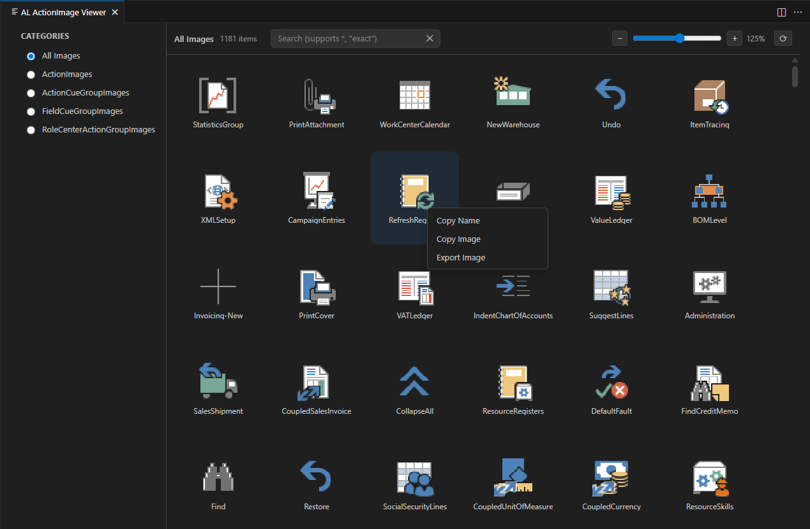

#  AL ActionImage Viewer

Loads AL Action Images directly from the [AL Language extension for Microsoft Dynamics 365 Business Central](https://marketplace.visualstudio.com/items?itemName=ms-dynamics-smb.al) and displays them in an easy to use overview with Categories, Search and Zooming abilities.

Right-Clicking on an image allows for Copying Name or Image and Exporting the Image.

---

## 🧰 Usage

Search for the command `AL ActionImage Viewer` in the command pallette and execute it.

In the new window that opens you can now search for your desired Action Image.

---

## 🧠 Requirements

[AL Language extension for Microsoft Dynamics 365 Business Central](https://marketplace.visualstudio.com/items?itemName=ms-dynamics-smb.al) needs to be installed.

## 🧩 Repository

GitHub: [Florian-Noever/al-actionimage-viewer](https://github.com/Florian-Noever/al-actionimage-viewer)

Bug reports and feature requests are welcome via [Issues](https://github.com/Florian-Noever/al-actionimage-viewer/issues).

---

## 📜 License

Licensed under the [MIT License](./LICENSE).
