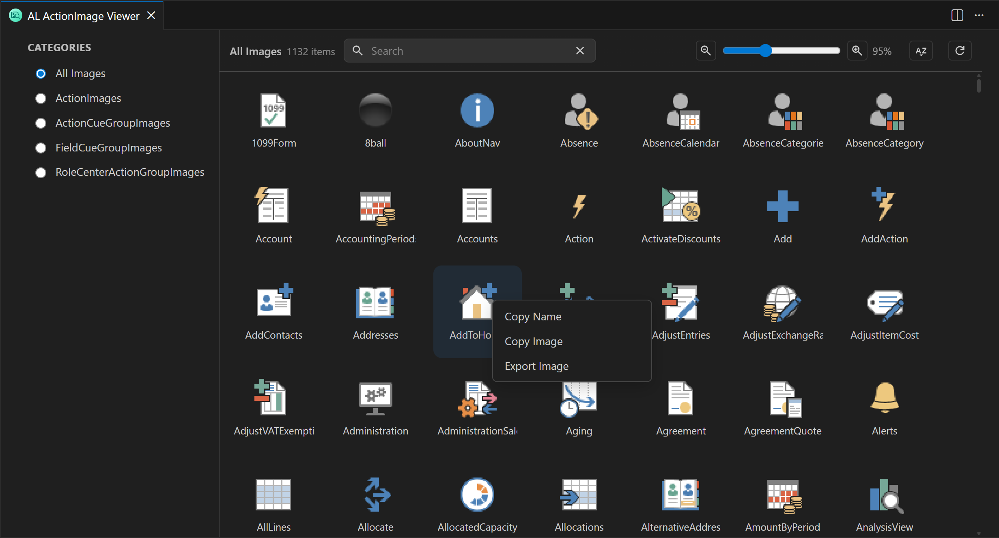

#  AL ActionImage Viewer

Browse, search, copy, and export AL Action Images loaded directly from the [AL Language extension for Microsoft Dynamics 365 Business Central](https://marketplace.visualstudio.com/items?itemName=ms-dynamics-smb.al). Images are organised by category, fully searchable, and zoomable. The viewer is available both as a full editor panel and as an always-visible activity bar sidebar.



---

## ✨ Features

- **Browse by category** — all image categories from the AL extension are listed in a collapsible rail, plus a synthetic "All Images" view that aggregates every image
- **Search** — filter images by name with plain text or wildcard patterns (`Action*`, `*Image`, `*Copy*`)
- **Zoom** — scale tiles from 40 % to 200 % using buttons, a slider, keyboard shortcuts, or Ctrl+Scroll
- **Copy** — copy an image's name or the image itself to the clipboard via the right-click context menu
- **Export** — save a single image or all images in a category to disk (via the context menu)
- **Drag & drop** — drag a tile directly to your file manager or desktop
- **Sidebar** — a persistent view in the activity bar that is always available without opening a separate panel
- **State persistence** — zoom level and rail collapse state are saved and restored across reloads

---

## 🧰 Usage

### Panel

Open the command palette (`Ctrl+Shift+P` / `Cmd+Shift+P`) and run **AL ActionImage Viewer**.

A new editor tab opens with:

- **Left rail** — a list of all image categories; click one to filter the grid, or right-click a category to export all its images
- **Top header** — search box, zoom controls, a sort toggle (A→Z / Z→A), and a reload button
- **Image grid** — virtualised tile grid; click a tile to select it, right-click for copy/export options

The rail collapses automatically when the panel is narrow and can also be toggled manually with the arrow button.

### Sidebar

Click the **AL ActionImage Viewer** icon in the activity bar. The sidebar shows the full image grid (without the category rail) and is always visible alongside your other panels.

### Search Tips

- Plain text (`action`) — matches any image whose name contains the text
- Wildcard prefix (`*Image`) — matches names that end with the term
- Wildcard suffix (`Action*`) — matches names that begin with the term
- Wildcards on both sides (`*Copy*`) — same as plain text substring match
- Quoted string (`"ActionRunObject"`) — case-insensitive exact match

---

## ⌨️ Keyboard Shortcuts

These shortcuts work in the panel and in the sidebar (except where noted). Shortcuts that modify zoom or category are disabled when a text input is focused.

| Key                  | Action                                                                     |
| -------------------- | -------------------------------------------------------------------------- |
| `Ctrl+F` / `Cmd+F`   | Focus the search box                                                       |
| `↑` `↓` `←` `→`      | Navigate the image grid                                                    |
| `Home` / `End`       | Jump to the first / last image                                             |
| `Menu` / `Shift+F10` | Open the context menu for the focused tile                                 |
| `1` – `9`            | Switch to category by position (`1` = All Images, `2` = first category, …) |
| `+` / `=`            | Zoom in                                                                    |
| `-`                  | Zoom out                                                                   |
| `0`                  | Reset zoom to 100 %                                                        |
| `Ctrl+Scroll`        | Zoom in / out with the mouse wheel                                         |
| `F5`                 | Reload images from the AL extension                                        |

---

## 🧠 Requirements

The [AL Language extension for Microsoft Dynamics 365 Business Central](https://marketplace.visualstudio.com/items?itemName=ms-dynamics-smb.al) must be installed.

> **Note:** This extension reads files from your local machine and must run on the local (UI) machine. It is not supported over remote connections (SSH, Dev Containers, WSL, etc.).

---

## 🧩 Repository

GitHub: [Florian-Noever/al-actionimage-viewer](https://github.com/Florian-Noever/al-actionimage-viewer)

Bug reports and feature requests are welcome via [Issues](https://github.com/Florian-Noever/al-actionimage-viewer/issues).

---

## 🛠️ Developer Notes

### Project Architecture

The extension is made up of three layers:

| Layer             | Technology                                                           | Purpose                                                                                                                                     |
| ----------------- | -------------------------------------------------------------------- | ------------------------------------------------------------------------------------------------------------------------------------------- |
| VS Code extension | TypeScript, VS Code API                                              | Activates the webview panel and sidebar, spawns the bridge binary, relays image data                                                        |
| Webview UI        | Vue 3, Vite, `@tanstack/vue-virtual`, `floating-vue`, `@vueuse/core` | Interactive image browser rendered inside the VS Code webview sandbox                                                                       |
| Bridge binary     | .NET 10, `System.CommandLine`                                        | Locates the AL Language extension DLL, reflects over it to extract image resources, and writes results to stdout as a custom binary payload |

### Build Commands

```bash
# Compile the TypeScript extension
npm run compile

# Build the Vue webview bundle (outputs to public/)
npm run build:webview

# Compile extension in watch mode (default build task)
npm run watch

# Publish the C# bridge binary for all platforms into bin/ (needs PowerShell 7)
npm run publish:bridge

# Package the extension as a .vsix (publishes the bridge first)
npm run package
```

The bridge binaries for `win32`, `linux` and `darwin` are not committed: `npm run publish:bridge` builds them into `bin/` locally, `npm run package` runs it before packaging, and CI builds them from the same publish profiles.

### CI & Releases

CI runs on every push and pull request through the shared workflows of [Florian-Noever/Florian-Noever](https://github.com/Florian-Noever/Florian-Noever/blob/main/.github/CI.md). One job runs the bridge's unit tests and builds the bridge for all three platforms; a second one takes those binaries, runs the integration tests and packs a preview VSIX.

To release, bump the version with `npm version x.y.z --no-git-tag-version`, add a CHANGELOG entry, and publish a GitHub release `vx.y.z` from a commit whose CI is green. The publish workflow builds and tests the tag, attaches the VSIX to the release and publishes it to the Visual Studio Marketplace.

### Debug Overlay

Press `Ctrl+Shift+D` (or `Cmd+Shift+D`) inside the webview to toggle a debug border overlay that visualises layout boundaries. A badge appears in the corner while the overlay is active.

---

## 📜 License

Licensed under the [MIT License](./LICENSE).

<br>
<br>

[](https://www.buymeacoffee.com/florian_noever)
